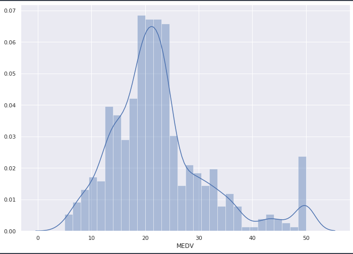
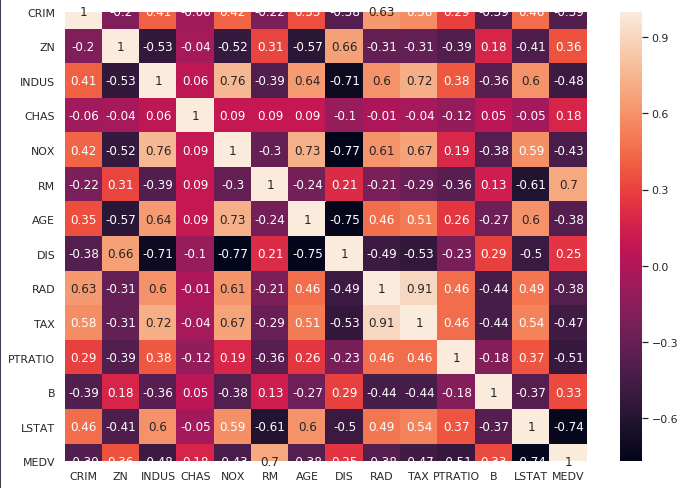
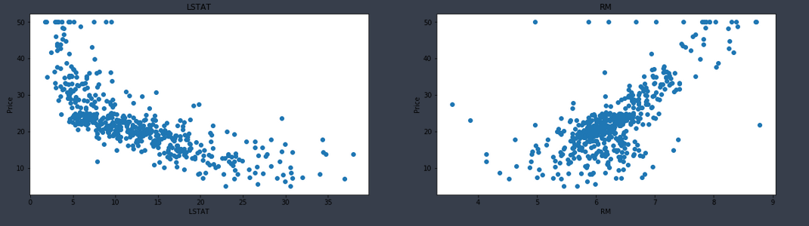

# Analysis-of-Boston-Housing-Data-set

### Project Description:

In this project I have developed and evaluated the performance of a model. The model is trained and tested on data collected from Boston Dataset sklearn.
These type of model would be usefult to the real estate agent who coluld use this information on daily basis.

### Software and Libraries:

    1.NumPy
    2.scikit-learn
    3.matplotlib
    4.pandas 
    5.seaborn
    6.Python 3
    
### Introduction
The Boston housing data was collected in 1978 and each of the 506 entries represent aggregated data about 14 features for homes from various suburbs in Boston, Massachusetts.
But for this project we only consider the important features such as:

### Images

 

The above graph shows that MEDV is distributed normally and there are some outliers presented. 

 

We can observe in the above image that RM has strong positive correlation with MEDV (0.7). LSAT has negative correlation -0.74 with the MEDV. 
RAD and TAX has correlation of 0.91. So these features are sotrongly paired to each other. 

 
We can observe in the above image that price decreases with increase of LSTAT. 
The price increases as RM increases linearly.Also there are few outliers present. 
   

### Observations
1. The target variable is MEDV which is just price.
2. We also find interesting data such as maximum,minimum prices.
3. Also there are no null values in the dataset.
4. The graph shows that MEDV is distributed normally and there are some outliers presented.
5. The correlation matrix chart gives us important relationship between variables.
6. RM has strong positive correlation with MEDV (0.7). LSAT has negative correlation -0.74 with the MEDV.
7. RAD and TAX has correlation of 0.91. So these features are sotrongly paired to each other.
8. price decreases with increase of LSTAT.
9. The price increases as RM increases linearly.Also there are few outliers present.
    
    
    

